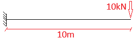
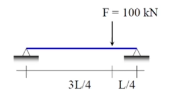

# beam-FEM

Biblioteca educacional em **Python** para análise de vigas pelo **Método dos Elementos Finitos (FEM)**, seguindo a teoria de Euler–Bernoulli.

Educational **Python** library for beam analysis using the **Finite Element Method (FEM)** based on Euler–Bernoulli beam theory.

---

## 📐 Hipóteses do modelo | Model assumptions

**Português**

* Vigas esbeltas (Euler–Bernoulli)
* Pequenas deformações
* Material linear elástico
* Análise estática
* Sistema plano 2D

**English**

* Slender beams (Euler–Bernoulli)
* Small deformations
* Linear elastic material
* Static analysis
* 2D planar system

---

## ⚙️ Instalação | Installation

**Português**

Como esta é uma biblioteca com fins educacionais, a maneira recomendada de instalá-la é através do `pip` em modo editável, diretamente do código-fonte.

Primeiro, clone o repositório:
```bash
# Clone este repositório (substitua pela URL correta)
$ git clone https://github.com/seu-usuario/beam-FEM.git
```

Em seguida, navegue até o diretório do projeto e instale as dependências em modo editável:
```bash
# Navegue até o diretório
$ cd beam-FEM

# Instale o pacote em modo editável
$ pip install -e .
```
O modo `-e` (editável) permite que alterações no código-fonte sejam refletidas imediatamente no ambiente Python, o que é ideal para estudo e desenvolvimento.

**English**

As this is an educational library, the recommended way to install it is via `pip` in editable mode, directly from the source code.

First, clone the repository. Then, navigate to the project directory and run the following command to install the package and its dependencies:
```bash
$ cd beam-FEM
$ pip install -e .
```
The `-e` (editable) flag is ideal for development and study, as it allows changes in the source code to be immediately available in your Python environment.

---

## 📊 Sistema de unidades | Unit system

As unidades devem ser **consistentes**:

| Grandeza               | Unidade |
| ---------------------- | ------- |
| Comprimento            | cm      |
| Área                   | cm²     |
| Inércia                | cm⁴     |
| Força                  | kN      |
| Momento                | kN·cm   |
| Módulo de elasticidade | kN/cm²  |
| Carga distribuída      | kN/cm   |

---

## 🧱 Estrutura do código | Code structure

A biblioteca é organizada em três classes principais:

* `Node` → nós da estrutura
* `Element` → elemento de viga
* `System` → sistema estrutural global

---

# 🔹 Classe Node

Representa um **nó estrutural** com posição, ações aplicadas e deslocamentos prescritos.

Represents a **structural node** with position, applied loads, and prescribed displacements.

### Graus de liberdade (GDL) | Degrees of freedom

Cada nó possui **3 GDL**:

| DOF  | Significado             |
| ---- | ----------------------- |
| `ux` | deslocamento horizontal |
| `uy` | deslocamento vertical   |
| `rz` | rotação em torno de z   |

### Exemplo | Example

```python
node = Node(
    position={"x": 0.0, "y": 0.0},
    label="N1",
    actions={"fx": 0.0, "fy": -10.0, "mz": 0.0},
    displacements={"ux": 0.0, "uy": 0.0, "rz": None}
)
```

### Convenções importantes | Important conventions

* `None` → GDL livre
* Valor numérico → GDL restrito (apoio)

---

# 🔹 Classe Element

Representa um **elemento de viga 2D Euler–Bernoulli**, com 2 nós e 6 GDL.

Represents a **2D Euler–Bernoulli beam element**, with 2 nodes and 6 DOFs.

### GDL do elemento | Element DOFs

```
[ux_i, uy_i, rz_i, ux_j, uy_j, rz_j]
```

### Funcionalidades | Features

* Matriz de rigidez local
* Transformação local → global
* Matriz de rigidez global do elemento
* Cargas distribuídas uniformes
* Vetor de cargas nodais equivalentes

### Carga distribuída | Distributed load

A carga `q` deve ser informada em **kN/cm**:

```python
element = Element(
    node_i=node_1,
    node_j=node_2,
    E=21000.0,
    A=100.0,
    I=8000.0,
    q=-0.05  # -5 kN/m
)
```

O método interno converte essa carga em **forças nodais equivalentes**.

---

# 🔹 Classe System

Responsável pela **montagem e solução** do sistema global FEM.

Responsible for **assembling and solving** the global FEM system.

### Principais responsabilidades | Main responsibilities

* Coletar nós únicos
* Numerar GDL globais
* Montar matriz de rigidez global `K`
* Montar vetor de forças global `F`
* Aplicar deslocamentos prescritos
* Resolver o sistema de equações
* Calcular reações de apoio

---

## ⚙️ Equações resolvidas | Solved equations

O sistema resolve:

```
K · u = F
```

Com particionamento:

* `u_f` → deslocamentos livres
* `u_c` → deslocamentos prescritos

As reações são calculadas por:

```
R = K_cf · u_f + K_cc · u_c − F_c
```

---

## 📌 Exemplo completo 1 | Full example



L = 1000cm, E = 21000kN/cm², A = 100cm², I = 8000cm⁴

```python
from beam import Element, System, Node

## Viga Engastada com 10m de comprimento e carga de -10kN na extremidade

## Propriedades Geometricas e dos Materiais
E = 21000.0      # kN/cm² (aço)
A = 100.0        # cm²
I = 8000.0       # cm⁴

node_1 = Node(
    position={"x": 0.0, "y": 0.0},
    label="N1",
    actions={"fx": 0.0, "fy": 0.0, "mz": 0.0},
    displacements={"ux": 0.0, "uy": 0.0, "rz": 0.0}  # engaste
)

node_2 = Node(
    position={"x": 1000.0, "y": 0.0},
    label="N2",
    actions={"fx": 0.0, "fy": -10.0, "mz": 0.0},  # carga pontual
    displacements={"ux": None, "uy": None, "rz": None}  # livre
)

element_1 = Element(
    node_i=node_1,
    node_j=node_2,
    E=E,
    A=A,
    I=I
)

system = System([element_1])

u, reactions = system.solve()
print(u, reactions)
```


## 📌 Exemplo completo 2 | Full example



L = 1000cm, E = 21000kN/cm², A = 100cm², I = 8000cm⁴

```python
from beam import Node, Element, System

node_1 = Node(
    position={"x": 0.0, "y": 0.0},
    label="N1",
    actions={"fx": 0.0, "fy": 0.0, "mz": 0.0},
    displacements={
        "ux": 0.0,   # 🔑 REMOVE modo rígido
        "uy": 0.0,
        "rz": None
    }
)

node_2 = Node(
    position={"x": 750.0, "y": 0.0},
    label="N2",
    actions={"fx": 0.0, "fy": -100.0, "mz": 0.0},  # carga pontual
    displacements={"ux": None, "uy": None, "rz": None}
)

node_3 = Node(
    position={"x": 1000.0, "y": 0.0},
    label="N3",
    actions={"fx": 0.0, "fy": 0.0, "mz": 0.0},
    displacements={"ux": None, "uy": 0.0, "rz": None}  # apoio simples
)

# --------------------------------------------------
# PROPRIEDADES
# --------------------------------------------------

E = 21000.0     # kN/cm²
A = 100.0       # cm²
I = 8000.0      # cm⁴

# --------------------------------------------------
# ELEMENTOS
# --------------------------------------------------

element_1 = Element(node_1, node_2, E, A, I)
element_2 = Element(node_2, node_3, E, A, I)

# --------------------------------------------------
# SISTEMA
# --------------------------------------------------

system = System([element_1, element_2])

u, reactions = system.solve()

print("Deslocamentos globais:")
print(u)

print("\nReações globais:")
print(reactions)
```

## ✅ Verificações importantes | Important checks

Sempre verifique:

* Equilíbrio global: ΣFy = 0, ΣM = 0
* Unidades consistentes
* Condições de contorno suficientes (evitar modos rígidos)

---

## 🎯 Objetivo do projeto | Project goal

**Português**

Esta biblioteca tem fins **didáticos**, visando entender profundamente:

* FEM em vigas
* Montagem matricial
* Condições de contorno
* Reações e deslocamentos

**English**

This library is **educational**, aiming to provide a deep understanding of:

* Beam FEM formulation
* Matrix assembly
* Boundary conditions
* Reactions and displacements

---

## 🚧 Próximos passos | Next steps

* Diagramas de esforço cortante e momento fletor
* Pós-processamento por seção
* Comparação com soluções analíticas

---

✍️ Desenvolvido para estudo e aprendizado em Engenharia Estrutural.
